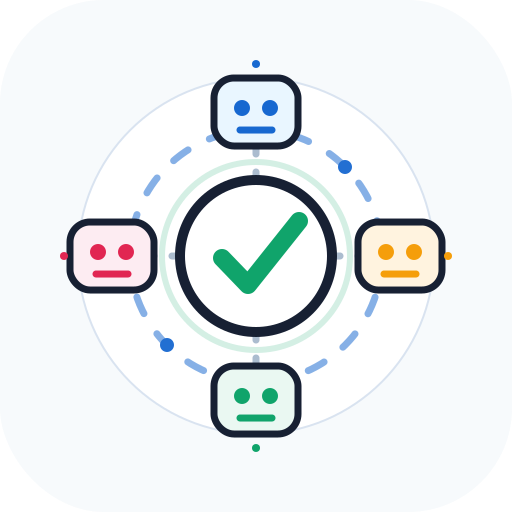

<p align="center">
  <a href="./assets/review-factory-logo.html">
    
  </a>
</p>

<h1 align="center">review-factory</h1>

<p align="center">
  <strong>AI code review run by a small factory.</strong>
</p>

<p align="center">
  <a href="./SKILL.md"></a>
  
</p>

<p align="center">
  <a href="#the-factory-specialised-agents-instead-of-one-big-prompt">The Factory</a>
  ·
  <a href="#reviewer-subagents-lineup">Reviewer Lineup</a>
  ·
  <a href="#usage">Usage</a>
  ·
  <a href="#why-portable-matters">Why Portable Matters</a>
</p>

> Inspired by Cloudflare's excellent article, [Orchestrating AI Code Review at scale](https://blog.cloudflare.com/ai-code-review/). review-factory adapts the multi-agent review orchestration idea into an agent skill.

---

Cloudflare ran [**130,000 AI code reviews across 5,000 repositories, with median cost around $1.00 per review**](https://blog.cloudflare.com/ai-code-review/). Their system reviews merge requests by classifying risk, sending work to specialist agents, and letting a coordinator judge the final output. The result is a fast, effective, filtered review with a scalable cost model that can survive real usage.

**review-factory** takes that idea and turns it into a skill. No CI platform required. Use it on a branch, a commit range, a PR diff, or uncommitted work.

## The Factory: specialised agents instead of one big prompt

Instead of asking one expensive model to review everything, **review-factory** splits the review into domain-specific agents and routes work by risk.

The coordinator uses the strongest available reasoning model for the hard part: sizing the change, selecting reviewers, filtering weak claims, fixing severity, and emitting the final verdict.

Specialist reviewers follow the **cheaper capable model** strategy: they run on lower-cost models because their job is narrower. Each reviewer has a tightly scoped prompt telling it exactly what to look for, and more importantly, what to ignore.

The agentic loop works like this:

1. Sizes the change first: trivial, lite, or full.
2. Ignores review noise: lockfiles, generated files, minified bundles, maps, vendored code.
3. Sends the diff only to the reviewers that make sense.
4. Asks each reviewer for structured findings (xml).
5. Runs a judge pass that deduplicates, rejects weak claims, fixes severity, and emits one verdict.

With this agentic orchestration you get the best of both worlds: the right level of intelligence for each code review at the right cost. 

## Reviewer Subagents Lineup

| Reviewer | Looks for |
|:---|:---|
| **Security** | Exploitable vulnerabilities, auth breaks, unsafe secrets, injection paths |
| **Correctness** | Concrete bugs, broken state, edge cases, regressions |
| **Performance** | Runtime, rendering, DB, network, caching, memory, bundle-size regressions |
| **Tests & Docs** | Missing coverage for risky behavior, stale docs, broken examples | 
| **Release** | Deployment, migration, packaging, config, changelog, compatibility risk |
| **AGENTS.md** | Whether agent instructions still match the changed project shape |
| **Generalist** | Fast pass for tiny diffs |

## Usage

Ask your agent for a review with the skill name:

```text
Use review-factory to review this branch against main.
```

Other useful prompts:

```text
Run review-factory on my uncommitted changes.
Run review-factory on the last commit.
Run review-factory on this PR diff and focus on security.
```

---

## Portable

Cloudflare's system is CI-native because it serves thousands of internal repositories. This skill intentionally leaves that part out. The orchestration is the reusable core: risk-tiered review, parallel specialists, structured findings, and one final judge pass.

That makes review-factory useful before CI, outside CI, inside local agent workflows, or anywhere you can inspect a repository.
